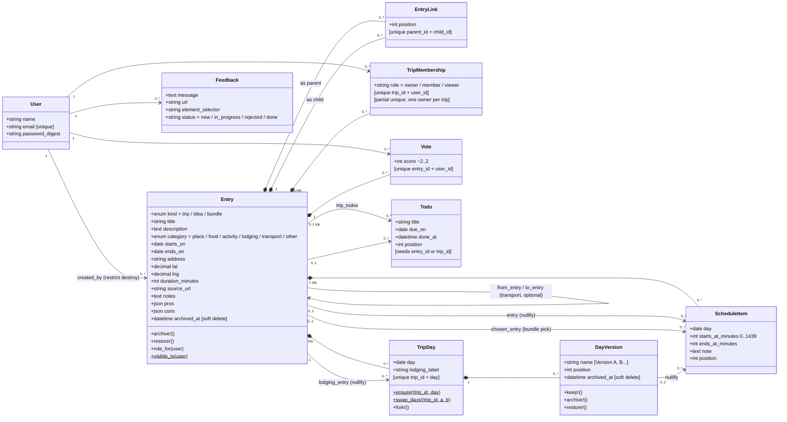

# Wend backend — data model (UML)

Source of truth: `backend/db/schema.rb` (schema version `2026_08_14_100001`, SQLite) and `backend/app/models/`.
Product-level narrative lives in [tech-data-model.md](tech-data-model.md); architecture rules in [architecture.md](architecture.md).

## The one thing to know first

There is **no `trips` table**. A trip, an idea, and a bundle are all rows in `entries`, distinguished by the
`kind` enum. Every `trip_id` foreign key in the database (`trip_memberships`, `trip_days`, `schedule_items`,
`todos`) points at `entries`, declared in Ruby as `belongs_to :trip, class_name: "Entry"`. All hierarchy lives
in the self-referencing many-to-many `entry_links` table (a DAG — cycles are rejected at save time), so an
idea can sit under several parents at once: the same restaurant can be in two trips, or in three day-bundles.

## Class diagram



Legend: `*--` composition = `dependent: :destroy` (child dies with parent); `-->` = plain reference,
optional or `dependent: :nullify` as labelled. `$` marks class-level methods. `[...]` marks constraints.

## Relationship reference

| Relationship | FK | Cardinality | On delete |
|---|---|---|---|
| User → Entry | `entries.created_by_id` (NOT NULL) | 1 : many | `restrict_with_error` — an author can't be destroyed |
| User → Vote / Feedback | `user_id` | 1 : many | destroy |
| User → TripMembership | `user_id` | 1 : many | `delete_all` (bypasses last-owner guard) |
| Entry ↔ Entry | `entry_links.parent_id` / `child_id` | many : many (DAG) | link rows destroyed from either side |
| Entry → Entry | `from_entry_id`, `to_entry_id` | optional | — (transport origin/destination) |
| Entry(trip) → TripMembership | `trip_memberships.trip_id` | 1 : many | `delete_all` |
| Entry(trip) → TripDay | `trip_days.trip_id` | 1 : many, unique per day | destroy |
| Entry(trip) → ScheduleItem | `schedule_items.trip_id` | 1 : many | destroy |
| Entry(trip) → Todo | `todos.trip_id` | optional | destroy |
| Entry → Todo | `todos.entry_id` | optional (entry **or** trip required) | destroy |
| Entry → Vote | `votes.entry_id` | 1 : many, one per user | destroy |
| Entry → ScheduleItem | `schedule_items.entry_id`, `chosen_entry_id` | optional | nullify |
| Entry → TripDay | `trip_days.lodging_entry_id` | optional | nullify |
| TripDay → DayVersion | `day_versions.trip_day_id` | 1 : many | destroy |
| DayVersion → ScheduleItem | `schedule_items.day_version_id` | optional | nullify |

## Domain layers, top to bottom

1. **Identity & access** — `User`; `TripMembership` is the *sole* authority on trip access
   (`owner`/`member`/`viewer`, exactly one owner per trip enforced by a partial unique index).
   Access flows *downward* through the entry DAG via a recursive CTE (`Entry.visible_to`, depth-capped at 20).
2. **The Entry graph** — everything the user keeps. `kind: idea` rows with no trip ancestor form
   "the library" (collection mode). Lifting an idea into its own trip or absorbing one trip into another
   is just a `kind` flip plus link rewiring — an `after_save` callback syncs the owner membership on the
   kind transition. Over the API, `kind` is create-only: PATCH ignores it, so the flip happens only
   through the dedicated lift/absorb endpoints.
3. **Group opinion** — `Vote` (−2..2, 0 is a valid "meh"; withdrawing = deleting the row) and the
   `pros`/`cons` JSON arrays on `Entry` (normalized on write, never 422s).
4. **Checklists** — `Todo`, attachable at trip level, idea level, or both (both governing entries must
   then permit the action).
5. **Itinerary** — `TripDay` (lazy rows, one per trip+date) → `DayVersion` (side-by-side alternate plans;
   "Version A" wins; a day never loses its last live version) → `ScheduleItem` (a *placement*, minutes
   from midnight, no timezones). Schedule items are the only content-ish rows that get hard-destroyed,
   because they point at kept things rather than being kept things.
6. **Out of band** — `Feedback` (in-app bug reports), deliberately not an Entry.

## Key invariants ("nothing is discarded")

- Soft delete via `archived_at` on `entries` and `day_versions` only; no `default_scope` — filtering is
  explicit (`active` / `live`), and `visible_to` ignores archival so owners can restore.
- The entry graph must stay a DAG — `EntryLink#no_cycles` walks descendants before save.
- A trip can never lose its last owner (`TripMembership#refuse_last_owner` + partial unique index).
- A day can never lose its last live version (`DayVersion#archive!` returns false instead).
- Permissions are a **conjunction** over `governing_entry_ids` (the `Governed` concern on Entry, Todo,
  Vote, ScheduleItem, TripDay, DayVersion): weakest role wins, any unreadable entry denies.
- Every writable itinerary foreign key (`schedule_items.entry_id`/`chosen_entry_id`/`day_version_id`,
  `trip_days.lodging_entry_id`) must resolve inside its own trip's descendant graph — validated at the
  model, so foreign ids can't be smuggled through writable params.
- No STI, no counter caches, no state-machine or soft-delete gems — all by hand, on purpose.

## Notable non-ActiveRecord objects

- **`TripDateShift`** (`backend/app/models/trip_date_shift.rb`) — PORO modelling what changing a trip's
  dates does to the planned itinerary: shifts every `trip_day`/`schedule_item` by the start-date delta
  (walking in collision-safe order because of the `[trip_id, day]` unique index) and drops days outside
  the new range, destroying placements but never entries.
- **`Governed`** concern + Pundit policies (`backend/app/policies/`) — role resolution described above.
- **Hand-rolled serializers** (`backend/app/serializers/`) — `EntrySerializer.list` computes all derived
  read-model data (vote tallies, children counts, `scheduled` flag) in a fixed number of bulk queries.

## Viewing / rendering the diagram

The mermaid block above renders automatically on **GitHub**, **GitLab**, and in Claude Code artifacts —
no install needed there.

**VS Code** — built-in Markdown preview needs one extension:

```sh
code --install-extension bierner.markdown-mermaid
```

or search *"Markdown Preview Mermaid Support"* (`bierner.markdown-mermaid`) in the Extensions panel.
Then open this file and hit `⇧⌘V` (Preview). For editing diagrams with live syntax help, optionally add
`vstirbu.vscode-mermaid-preview`.

**CLI (export to SVG/PNG)**:

```sh
npm install -g @mermaid-js/mermaid-cli
mmdc -i doc/data-model-uml.md -o doc/data-model-uml.rendered.md   # replaces fences with SVGs
```

**Zero-install**: paste the fenced block into <https://mermaid.live>.
